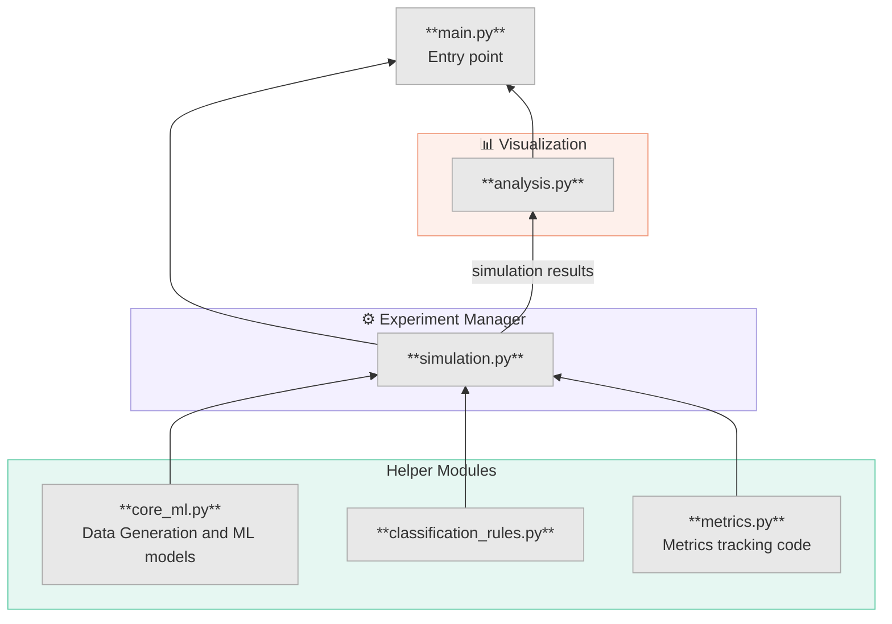

# RichMLP vs LazyMLP Dynamics Simulation

## Overview & The Learning Task
This project simulates and analyzes the learning dynamics of Multilayer Perceptrons (MLPs) by comparing two distinct network initialization regimes:
1. **Rich Regime (Low Variance):** The network initializes with a small variance in its weights and biases.
2. **Lazy Regime (High Variance):** The network initializes with a large variance. 

### The Core Task: A Simple Baseline
At its core, the experiment tests how these two regimes learn a simple, deterministic binary classification task. 
* **The Data:** The input consists of synthetic, one-hot encoded categorical features. For example, a data point might represent an object defined by 3 features (like color, shape, and size), each having multiple possible categories.
* **The Rule:** The network must classify the data based on a straightforward, hidden rule. In the simplest scenario, we use an `upper_half` rule: the network looks at one specific "deciding feature" and outputs `1` if the active category of that feature falls in the upper half of its possible values, and `0` otherwise.

In this pure baseline setup, the network trains on clean, noiseless data to minimize a standard classification loss without any secondary objectives.

### Adding Complexity: Noise, Reconstruction, and Dynamic Blocks
Once the baseline is established, the simulation can introduce several layers of complexity to test the robustness and adaptability of the Rich vs. Lazy regimes:
* **Noise Injection:** Gaussian noise is added to the inputs. We then evaluate how well each model handles this uncertainty by comparing its predictions against the theoretical Bayes Optimal predictor.
* **Dual-Loss Optimization:** The network can be forced to multitask. By adjusting the `alpha_rec` parameter, the model is trained to not only classify the data but also *reconstruct* the original, clean input features simultaneously.
* **Dynamic Environments (Blocks):** Training occurs in continuous, sequential stages called **Blocks**. While the models retain their weights, the environment can suddenly change between blocks. A new block might introduce a different classification rule (like a `parity` rule) or mask out (zero) specific features entirely. This allows us to observe how quickly each regime "forgets" obsolete rules and adapts to new constraints.

---

## Project Structure

The codebase is split into four roles with a strict one-way dependency: `main` → `simulation` → (ML & logic modules), and separately `simulation` → `analysis`.



- **`main.py`** — Entry point. Defines the config, launches a simulation run, and passes the results to the analyzer.

- **`simulation.py`** — The experiment manager. Handles config parsing, seed locking, and sequential block execution. Calls into the three ML & logic modules and injects a metric-collection callback into the training loop. Produces a structured results object that is the sole input to `analysis.py`.

- **`core_ml.py`** — The pure PyTorch core. Contains the `Dataset` generator (exhaustive one-hot combination builder), the `Classifier` MLP architecture, the `train_classifier` loop, and the `LogisticDecoder` linear probe.

- **`classification_rules.py`** — A self-contained registry of label-generating functions (`upper_half`, `lower_half`, `parity`, `probabilistic_shortcut`). Adding a new rule requires touching only this file.

- **`metrics.py`** — All epoch-by-epoch tracking logic: the structured tracker dict, the callback factory injected into training, noise masking, and Bayes-optimal probability computation.

- **`analysis.py`** — Entirely downstream of `simulation.py`. `SimulationAnalyzer` consumes the results object and is responsible for all plots, PCA, parameter distribution analysis, and decoder readout summaries. It never touches model state directly.


## Configuration & Degrees of Freedom

The entire simulation is controlled via a configuration dictionary. Some parameters are "global" and apply to all blocks, and some are "per-block" parameters.

**1. Network Architecture & Initialization, and Data Structure** *(global)*
* `hidden_size`: Number of neurons per hidden layer.
* `n_hidden`: Number of hidden layers.
* `w_scale_low`, `b_scale_low`: Weight and bias initialization scale for the Rich (Low Variance) model.
* `w_scale_high`, `b_scale_high`: Weight and bias initialization scale for the Lazy (High Variance) model.
* `activation_type`: Activation function (`"Identity"`, `"Tanh"`, `"RelU"`, `"Sigmoid"`).
* `optimizer_type`: Optimizer (`"Adam"`, `"SGD"`).
* `lr`: Learning rate.
* `batch_size`: Batch size for the DataLoader.
* `features_types`: List defining the dimension of each one-hot encoded feature (e.g., `[2, 2]`).
* `seed`: Global random seed for reproducibility.

**2. Experiment Blocks** *(per-block)*

`exp_blocks` is a list of dictionaries, each defining a sequential training phase. All global parameters can be overridden within a block.

* `block_name`: String identifier for the block (e.g., `"B1"`).
* `epochs`: Number of training epochs for this block.
* `rule`: Classification rule to apply. Available rules:
  * `"upper_half"` — label is 1 if the deciding feature falls in the lower half of its range. Requires `deciding_feature` (feature index).
  * `"lower_half"` — inverse of `upper_half`. Requires `deciding_feature`.
  * `"parity"` — label is 1 if the deciding feature value is even. Requires `deciding_feature`.
  * `"probabilistic_shortcut"` — compares two features probabilistically. Requires `primary_idx`, `secondary_idx`, `p_agree`, `p_disagree`.
* `zero_features`: List of feature indices to ablate (set to 0) during this block.
*  `sd`: Standard deviation of Gaussian noise added to inputs during training.
* `alpha_class`: Weight of the classification loss (default `1.0`).
* `alpha_rec`: Weight of the reconstruction loss (default `0.0`).

**3. Decoder** *(optional, global)*

If a `decoder` key is present in the config, a `LogisticDecoder` probe is trained and evaluated periodically during training.

* `train_sd`: Noise level used when training the decoder (default `0`).
* `test_sd`: Noise level used when evaluating the decoder (default `0.2`).
* `samples_per_point`: Number of noisy samples per data point for evaluation at the end of the Decoder's training (default `20`).
* `freq`: Evaluation frequency in epochs (default `5`).
* `epochs`: Number of epochs to train the decoder (default `100`).
* `lr`: Learning rate for the decoder optimizer (default `0.1`).
---

## Getting Started

### Installation
This project uses `uv` and `pyproject.toml` for deterministic dependency management. 

1. Ensure Python >= 3.11 and `uv` are installed (`pip install uv`).
2. Clone the repository and navigate to the project root.
3. Sync the environment:
```bash
uv sync --active
```
**Note:** Plots are designed to render inline within PyCharm's built-in plot viewer. Using a pop-up backend such as `Qt5Agg` may cause display issues.
